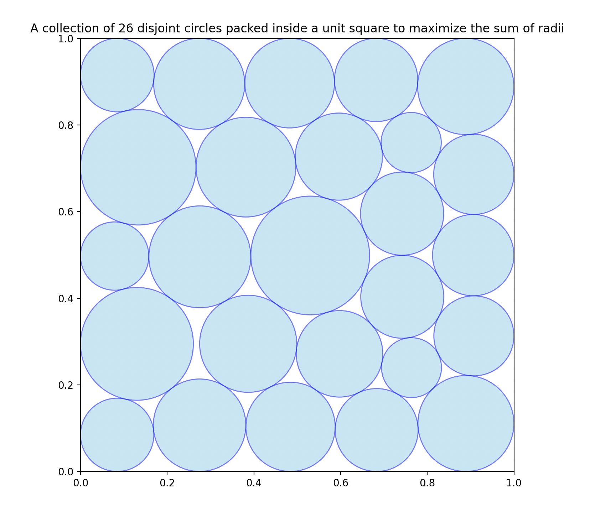

# Packing Circles in Unit Square Example

本示例演示了如何使用 **LoongFlow** 框架来解决计算几何优化问题。目标是演化出一个 Python 算法，在一个受限空间内找到特定的圆排列配置。

## 问题描述

目标是在单位正方形 $[0,1] \times [0,1]$ 内找到 $n=26$ 个互不相交的圆的配置，使其半径之和最大化。

关于问题背景和类似结果，请参考官方仓库：
**[AlphaEvolve 仓库](https://github.com/google-deepmind/alphaevolve_repository_of_problems/blob/main/experiments/packing_circles_max_sum_of_radii/packing_circle_max_sum_of_radii.ipynb)**

在这个特定配置（$n=26$）中，我们的目标是超越已知的半径之和基准。

## 项目结构

- **`initial_program.py`**: 起始种子代码。它包含基本的函数签名 `construct_packing` 和一个需要被演化的结构化实现（占位符）。
- **`eval_program.py`**: 评估逻辑。它以安全/隔离的方式执行生成的代码，验证几何约束（圆不重叠、边界限制），并根据半径之和计算分数。
- **`task_config.yaml`**: 主配置文件，定义了 LLM 提示词、演化参数（迭代次数、目标分数）以及智能体组件（规划器、执行器、总结器）。

## 如何运行

要开始演化过程，你需要使用 `general_evolve_agent.py` 入口点。请确保你的 `PYTHONPATH` 包含了项目根目录，以便 Python 能够找到 `agents` 和 `evolux` 模块。

### 1. 前置条件

确保你位于本地项目的根目录中（包含 `agents/` 和 `evolux/` 的目录）。

### 2. 执行命令

运行以下命令以启动演化。该命令加载基础配置，并从相应文件中注入初始代码和评估逻辑。

```bash
python agents/general_evolve/general_evolve_agent.py \
  --config agents/general_evolve/examples/packing_circle_in_unit_square/task_config.yaml \
  --initial-file agents/general_evolve/examples/packing_circle_in_unit_square/initial_program.py \
  --eval-file agents/general_evolve/examples/packing_circle_in_unit_square/eval_program.py \
  --log-level INFO
```

**参数解释：**

- `--config`: 指向 YAML 配置文件的路径 (`task_config.yaml`)。
- `--initial-file`: 包含种子代码的 Python 文件路径 (`initial_program.py`)。该文件的内容将被注入到 `evolve.initial_code` 中。
- `--eval-file`: 包含评估逻辑的 Python 文件路径 (`eval_program.py`)。该内容将被注入到 `evolve.evaluator.evaluate_code` 中。
- `--log-level`: 设置日志的详细程度（例如：INFO, DEBUG）。

### 3. 配置亮点

`task_config.yaml` 预配置了以下策略：

- **Planner**: `evolve_planner`（处理代码修改的战略方向）。
- **Executor**: `evolve_executor_fuse`（一个强大的执行器，融合了多种思维过程/候选方案）。
- **Summarizer**: `evolve_summary`（为下一次迭代总结执行结果）。
- **Target**: 演化旨在达到 `1.0` 的目标分数（相对于基准进行归一化）。

## 演化过程与结果

系统通过多代代码迭代，试图最大化 $n=26$ 个圆的半径之和。下面是演化不同阶段生成的堆积配置的可视化图。



### 最终结果

LoongFlow 找到的最佳解决方案。

**结果指标：**

- **半径之和：** 2.63596324918732（超过参考基准：2.6358627564136983）

## 故障排除

- **TimeoutError**: `eval_program.py` 强制执行严格的超时（配置中默认为 3600 秒，尽管内部函数调用的超时时间更短）。如果生成的代码进入无限循环，它将被终止并标记为失败。
- **ModuleNotFoundError**: 确保你的 `PYTHONPATH` 设置正确。在运行命令之前，你可能需要在项目根目录下运行 `export PYTHONPATH=$PYTHONPATH:.`。
